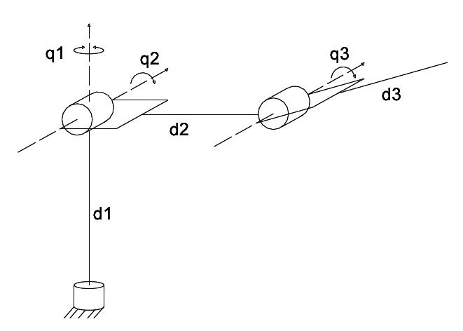
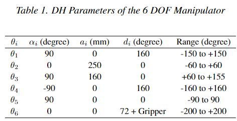

# DH Table and End-Effector Position Calculation

## Objective:

1. **Determine the DH table**:
   - Examine the robotic arm diagram provided and identify the necessary Denavit-Hartenberg (DH) parameters for each joint.
   - Populate the DH table with the link lengths \( a_i \), link offsets \( d_i \), link twists \( \alpha_i \), and joint angles \( \theta_i \).
   
2. **Calculate the position of the end-effector**:
   - Using the DH table, calculate the forward kinematics to determine the position of the arm's end-effector.

## Robotic Arm Diagram:

Below is the diagram of the robotic arm that you will use to determine the DH parameters:

## DH Parameter Table Example:

Here's an example of DH parameters for a 6 DOF manipulator to guide you:

d in above image is mm not degree,

calculate the end effector position in meter unit using following theta:

- theta1 = 45 degree
- theta2 = 0 degree
- theta3 = 90 degree
- theta4 = 0 degree
- theta5 = 0 degree
- theta6 = 45 degree